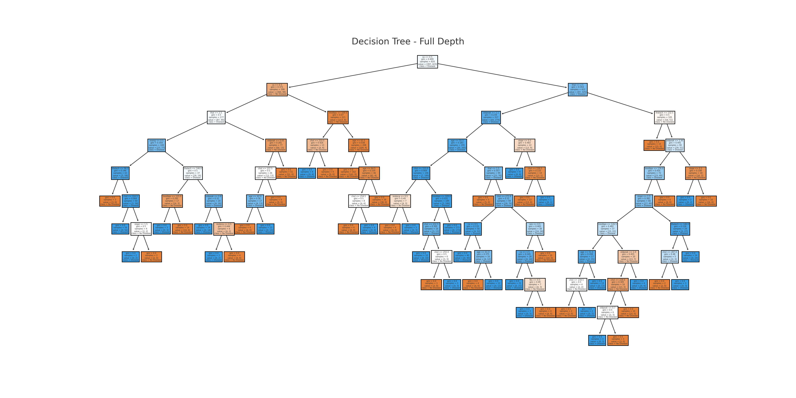
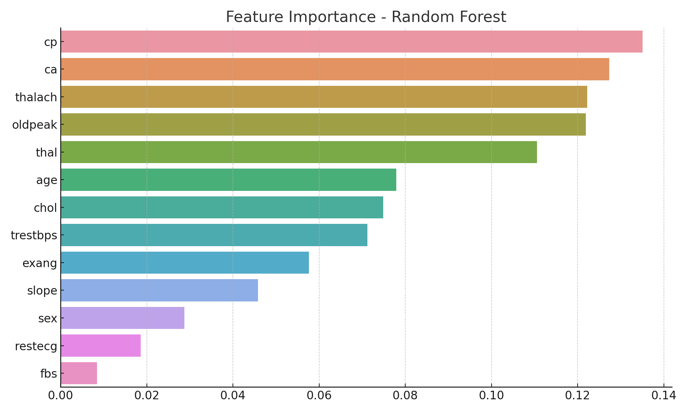

🔍 Heart Disease prediction using Decision Tree & Random Forest with feature importance, cross-validation & visualizations.

# ❤️ Heart Disease Prediction using Decision Trees and Random Forests

## 📌 Task 5 - AI & ML Internship

**Objective:**  
Apply tree-based machine learning models (Decision Tree and Random Forest) to predict heart disease. Analyze model performance, visualize trees, evaluate with cross-validation, and interpret feature importances.

---

## 📁 Dataset

We used the [Heart Disease Dataset](https://www.kaggle.com/datasets/johnsmith88/heart-disease-dataset), which contains clinical features such as age, sex, cholesterol, blood pressure, etc., and a target variable `target` (1 = disease, 0 = no disease).

---

## ⚙️ Tools & Libraries
- Python
- Pandas, NumPy
- Scikit-learn (DecisionTreeClassifier, RandomForestClassifier)
- Matplotlib & Seaborn (Visualization)

---

## 🔍 Steps Performed

### 1. Data Loading & Exploration
- Loaded dataset using pandas
- Checked for missing values and data types
- Split features and target (`target` column)

### 2. Train-Test Split
```python
X_train, X_test, y_train, y_test = train_test_split(X, y, test_size=0.2, random_state=42)
```

---

## 🌳 Model 1: Decision Tree
- Trained using `DecisionTreeClassifier`
- Achieved good accuracy but **overfitting risk** due to deep tree
- **Visualized** full tree using `plot_tree`

**📊 Accuracy:** ~77%  


---

## ✂️ Model 2: Limited Depth Decision Tree
- Tree depth limited using `max_depth=3`
- Reduced overfitting and improved generalization

**📊 Accuracy:** ~80%

---

## 🌲 Model 3: Random Forest Classifier
- Ensemble model using 100 trees
- Better performance due to **bagging** and **random feature selection**
- Less overfitting than single tree

**📊 Accuracy:** ~88%  
**✅ Best performing model**

---

## 📌 Feature Importance (from Random Forest)
The most important features identified were:

| Feature | Importance |
|---------|------------|
| cp (chest pain type) | ⭐ Highest |
| thalach (max heart rate) | |
| oldpeak | |
| ca (major vessels) | |



---

## 🔁 Cross-Validation
Used **5-Fold Cross Validation** to evaluate the model more reliably.

```python
cv_scores = cross_val_score(rf_model, X, y, cv=5)
```

**Average Accuracy:** ~85%

---

## 🧠 What I Learned
- How decision trees work and their limitations
- Importance of controlling depth to prevent overfitting
- How random forests improve accuracy via ensemble learning
- Feature importance analysis and model evaluation using cross-validation

---

## 📂 Repository Contents
- `heart_disease_tree_models.py` - Full source code
- `heart.csv` - Dataset
- `decision_tree_full.png` - Tree visualization
- `feature_importance_rf.png` - Feature importance plot
- `README.md` - Project documentation


---

## ✨ Credits
- [Kaggle Heart Disease Dataset](https://www.kaggle.com/datasets/johnsmith88/heart-disease-dataset)
- Scikit-learn documentation
